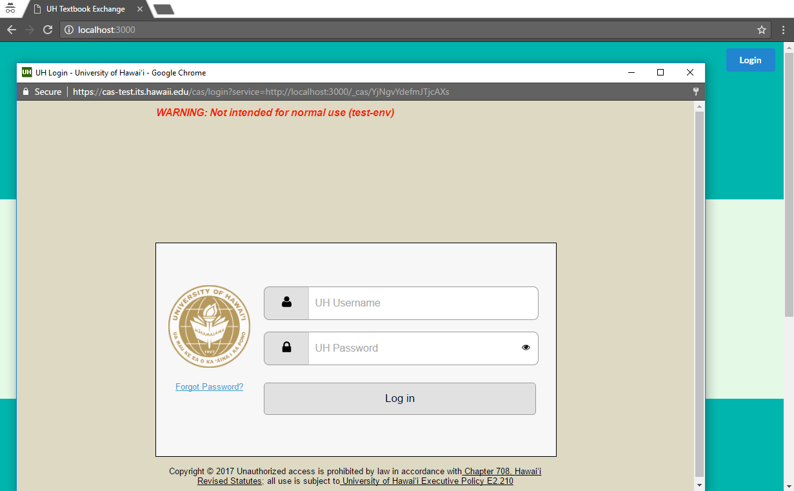

# Table of contents

* [About UH Textbook Exchange](#about-uh-textbook-exchange)

# About UH Textbook Exchange 

Finding a reasonable price on textbooks can be difficult.  Although buying textbooks from your friends might be of some help, there is a large body of students at UH Manoa who could have exactly what you're looking for.  Textbook Exchange is a Meteor application providing a means for UH Manoa students to communicate their textbooks needs, whether they are selling or buying.

The home page shows current book listings and login/signup.

Anyone with a UH account can log in by clicking on the login button.  The UH CAS authentication screen then appears and requests your UH account and password.

Users can create profiles to show their major and courses taken.  Users can also list books that they are awilling to sell as well as listings they may be interested in.

Users can also search for books based on criteria such as major and classes.

