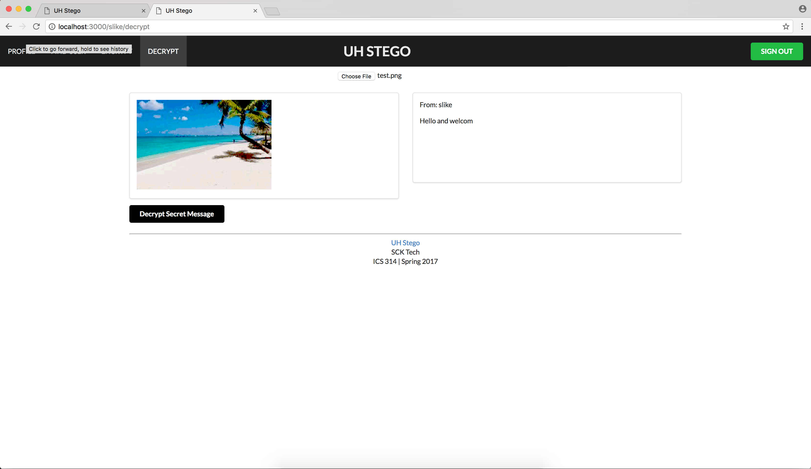
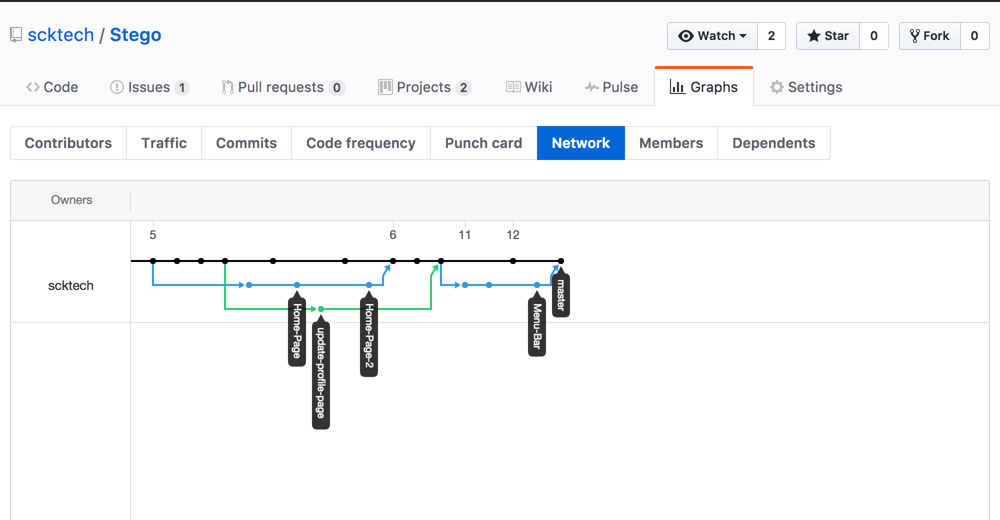
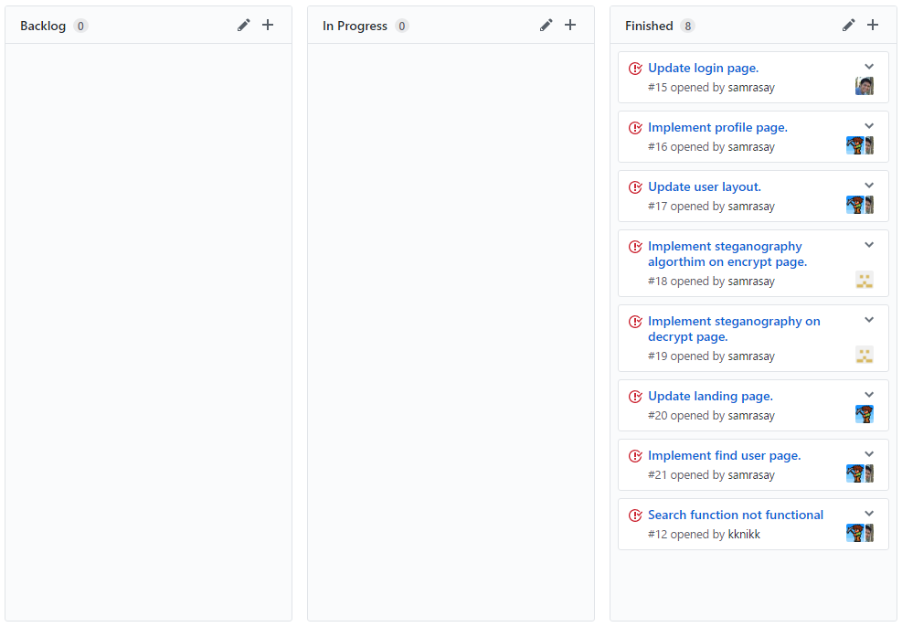

# Table of Contents

* [About UH Stego](#about-uh-stego)
* [Features](#features)
* [Development history](#development-history)
  * [Milestone 1: Mockup development](#milestone-1-mockup-development)
  * [Milestone 2: Site function development](#milestone-2-site-function-development)
* [UH Stego on Galaxy](http://uhstego.meteorapp.com/)

# About UH Stego 

UH students commonly send text messages to communicate, but sometimes SMS or instant chat is not secure enough. Truly sensitive data should be transported or hidden to ensure that it is not left exposed to nosey third parties.

Our application allows students hide sensitive text messages or images steganographically. These doctored images can be used a transport media to deliver messages without raising any suspicion or attracting unwanted attention. Once in the hands of the proper recipient, the hidden message can be extracted.

# Features
* Create a profile to send and receive messages.
* Find other users to send private messages.
* Encrypt a message using steganography.
* Decrypt an encrypted message that used steganography.

# Login Page

Users are greeted at the landing page with only a login button.  Since UH Stego deals with sensitive information, outsiders should not be able to understand the purpose of the application.  Anyone with a UH account can login to UH Stego.  Upon clicking the login button, the UH CAS authentication screen will appear and request for your UH username and password.

# Landing Page

Once logged in, users are greeted with information about UH Stego and a top menu filled with options.

# Profile Page
Users can create profiles to send and receive messages, and include a little bit of information about themselves.

# Encrypt Page
To encrypt a message, users fill out the text box above to create a message.  A user can then choose an image file to hide their message in.  A steganographic image is then generated after clicking the submit button.

# Decrypt Page
To decrypt a message, users can place the URL of their encrypted image and have it decrypted.  The decrypted message will appear in the box below.

# Find User Page
Users can find other users to communicate with.

They can specify the user they would like to contact by entering their UH username.

# Development History

The development process for UH Stego conformed to [Issue Driven Project Management](http://courses.ics.hawaii.edu/ics314s17/modules/project-management/) practices. Development consisted of Milestones which contained 2-3 days worth of work.  Github tasks were utilized to keep track of tasks during the completion of a milestone.  The following documents the development history of UH Stego.

## Milestone 1: Mockup Development

This milestone started on March 29, 2017 and ended on April 12, 2017.

The goal of Milestone 1 was to create a set of HTML pages that provided a mockup of the pages to be used in the application.  Mockup pages were developed within Meteor.  Each page acted as a template to outline the functions that needed to be implemented in UH Stego.  The following are the mockup pages that were created during M1:

Milestone 1 was implemented as [Stego GitHub Milestone M1](https://github.com/scktech/Stego/projects/1):

Milestone 1 consisted of six issues, and progress was managed via the [Stego GitHub Milestone M1](https://github.com/scktech/Stego/projects/1).  During the M1 Milestone, each group member was assigned two pages to mockup for development of UH Stego.

Below is the commit history for UH Stego.  Each team member was responsible for creating their own branch to update their mockups.

## Milestone 2: Site Function Development

This milestone started on April 12, 2017 and is currently ongoing.

The goal of Milestone 2 is to implement the functions of the site.  This includes the encryption and decryption of messages, as well as being able to find users by their name or UH username.  The following are tasks that are expected to be completed in [Milestone 2](https://github.com/scktech/Stego/projects/2):

The profile page was implemented and now adds new profiles to the ProfilesCollection.

The encrypt page was updated to include a recipient to send to from within the applicaiton and an encryption key. 

