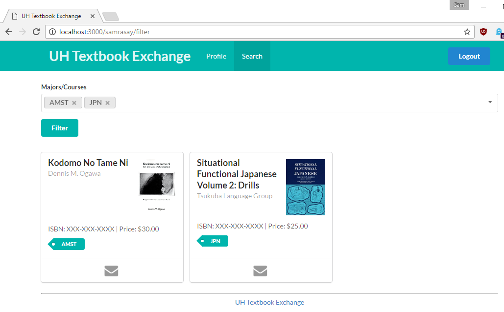

# Table of contents

* [About UH Textbook Exchange](#about-uh-textbook-exchange)
* [What's Next](#whats-next)

# About UH Textbook Exchange 

Finding a reasonable price on textbooks can be difficult.  Although buying textbooks from your friends might be of some help, there is a large body of students at UH Manoa who could have exactly what you're looking for.  Textbook Exchange is a Meteor application providing a means for UH Manoa students to communicate their textbook needs, whether they are selling or buying.

The home page shows current book listings and login/signup.

Anyone with a UH account can log in by clicking on the login button.  The UH CAS authentication screen then appears and requests your UH account and password.

Users can create profiles to show their major and what courses they've taken.  Majors/Courses will be used to help find books through a search using a filter.

Users can also search for books based on criteria such as major and classes.  Results will show books that are available for sale based on filters.  Books listed show title, author, ISBN, and price.

# What's Next

* Listing creation page - Allows a user to put up a book for sale with its: title, author, isbn, picture, major/courses required, price.
