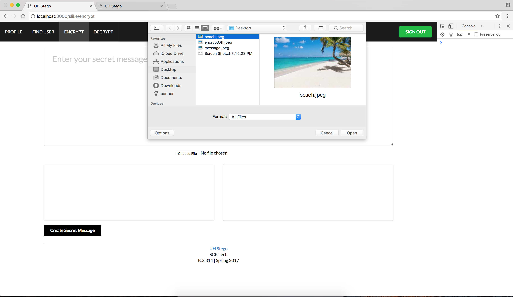
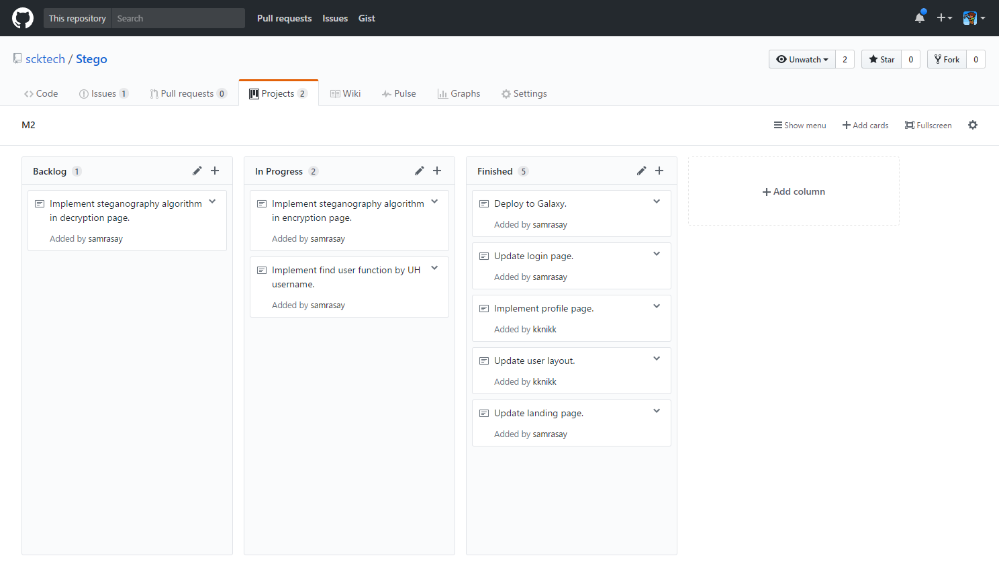

# Table of Contents

* [About UH Stego](#about-uh-stego)
* [Features](#features)
* [Guided Tour](#guided-tour)
* [Developer Guide](#developer-guide)
* [Development history](#development-history)
  * [Milestone 1: Mockup development](#milestone-1-mockup-development)
  * [Milestone 2: Site function development](#milestone-2-site-function-development)
  * [Milestone 3: Connect UI to data model](#milestone-3-connect-ui-to-data-model) 
* [UH Stego on Galaxy](http://uhstego.meteorapp.com/)

# About UH Stego 

UH students commonly send text messages to communicate, but sometimes SMS or instant chat is not secure enough. Truly sensitive data should be transported or hidden to ensure that it is not left exposed to nosey third parties.

Our application allows students hide sensitive text messages or images steganographically. These doctored images can be used a transport media to deliver messages without raising any suspicion or attracting unwanted attention. Once in the hands of the proper recipient, the hidden message can be extracted.

# Features
* Create a profile to send and receive messages.
* Find other users to send private messages.
* Encrypt a message using steganography.
* Decrypt an encrypted message that used steganography.

# Guided Tour
# Login Page

Users are greeted at the landing page with only a login button.  Since UH Stego deals with sensitive information, outsiders should not be able to understand the purpose of the application.  Anyone with a UH account can login to UH Stego.  Upon clicking the login button, the UH CAS authentication screen will appear and request for your UH username and password.


# Home/Landing Page

Once logged in, users are greeted with their current profile information.  Users can edit their profile, encrypt a message, or dec


# Profile Page
Users can create profiles to send and receive messages, and include a little bit of information about themselves.


# Encrypt Page
To encrypt a message, users fill out the text box above to create a message.  A user can then choose an image file to hide their message in.  A steganographic image is then generated after clicking the submit button.



The orginal image will then appear, next to its steganographic double.  Users can then download the image to send to others or keep for personal use.


# Decrypt Page
To decrypt a message, users can upload the image that they received, and decrypt the message using the button below.  The decrypted message will appear in the text box to the side.


# Find User Page
Users can find other users to communicate with.


# Developer Guide

First, [install Meteor](https://www.meteor.com/install).

Second, [download a copy of UH STEGO](https://github.com/scktech/Stego), or clone it using git.
  
Third, cd into the app/ directory and install libraries with:

```
$ meteor npm install
```

Fourth, run the system with:

```
$ meteor npm run start
```

If all goes well, the application will appear at [http://localhost:3000](http://localhost:3000). If you have an account on the UH test CAS server, you can login. 

# Application Design

## Directory structure

The top-level directory structure contains:

```
app/        # holds the Meteor application sources
config/     # holds configuration files, such as settings.development.json
.gitignore  # don't commit IntelliJ project files, node_modules, and settings.production.json
```

This structure separates configuration files (such as the settings files) in the config/ directory from the actual Meteor application in the app/ directory.

The app/ directory has this top-level structure:

```
client/
  lib/           # holds Semantic UI files.
  head.html      # the <head>
  main.js        # import all the client-side html and js files. 

imports/
  api/           # Define collection processing code (client + server side)
    base/
    interests/
    encryptImg/
    profile/
  startup/       # Define code to run when system starts up (client-only, server-only)
    client/        
    server/        
  ui/
    components/  # templates that appear inside a page template.
    layouts/     # Layouts contain common elements to all pages (i.e. menubar and footer)
    pages/       # Pages are navigated to by FlowRouter routes.
    stylesheets/ # CSS customizations, if any.

node_modules/    # managed by Meteor

private/
  database/      # holds the JSON file used to initialize the database on startup.

public/          
  images/        # holds static images for landing page and predefined sample users.
  
server/
   main.js       # import all the server-side js files.
```

## Import conventions

This system adheres to the Meteor 1.4 guideline of putting all application code in the imports/ directory, and using client/main.js and server/main.js to import the code appropriate for the client and server in an appropriate order.

This system accomplishes client and server-side importing in a different manner than most Meteor sample applications. In this system, every imports/ subdirectory containing any Javascript or HTML files has a top-level index.js file that is responsible for importing all files in its associated directory.   

Then, client/main.js and server/main.js are responsible for importing all the directories containing code they need. For example, here is the contents of client/main.js:

```
import '/imports/startup/client';
import '/imports/ui/components/form-controls';
import '/imports/ui/components/directory';
import '/imports/ui/components/user';
import '/imports/ui/components/landing';
import '/imports/ui/layouts/directory';
import '/imports/ui/layouts/landing';
import '/imports/ui/layouts/shared';
import '/imports/ui/layouts/user';
import '/imports/ui/pages/directory';
import '/imports/ui/pages/filter';
import '/imports/ui/pages/landing';
import '/imports/ui/pages/user';
import '/imports/ui/pages/encrypt';
import '/imports/ui/pages/home';
import '/imports/ui/pages/find';
import '/imports/ui/stylesheets/style.css';
import '/imports/api/base';
import '/imports/api/profile';
import '/imports/api/interest';
import '/imports/api/encryptImg';

```

Apart from the last line that imports style.css directly, the other lines all invoke the index.js file in the specified directory.

We use this approach to make it more simple to understand what code is loaded and in what order, and to simplify debugging when some code or templates do not appear to be loaded.  In our approach, there are only two places to look for top-level imports: the main.js files in client/ and server/, and the index.js files in import subdirectories. 

Note that this two-level import structure ensures that all code and templates are loaded, but does not ensure that the symbols needed in a given file are accessible.  So, for example, a symbol bound to a collection still needs to be imported into any file that references it. 

# Development History

The development process for UH Stego conformed to [Issue Driven Project Management](http://courses.ics.hawaii.edu/ics314s17/modules/project-management/) practices. Development consisted of Milestones which contained 2-3 days worth of work.  Github tasks were utilized to keep track of tasks during the completion of a milestone.  The following documents the development history of UH Stego.

## Milestone 1: Mockup Development

This milestone started on March 29, 2017 and ended on April 12, 2017.

The goal of Milestone 1 was to create a set of HTML pages that provided a mockup of the pages to be used in the application.  Mockup pages were developed within Meteor.  Each page acted as a template to outline the functions that needed to be implemented in UH Stego.  The following are the mockup pages that were created during M1:


Milestone 1 was implemented as [Stego GitHub Milestone M1](https://github.com/scktech/Stego/projects/1):


Milestone 1 consisted of six issues, and progress was managed via the [Stego GitHub Milestone M1](https://github.com/scktech/Stego/projects/1).  During the M1 Milestone, each group member was assigned two pages to mockup for development of UH Stego.


Below is the commit history for UH Stego.  Each team member was responsible for creating their own branch to update their mockups.


## Milestone 2: Site Function Development

This milestone started on April 12, 2017 and ended on April 27, 2017.

The goal of Milestone 2 is to implement the functions of the site.  This includes the encryption and decryption of messages, as well as being able to find users by their name or UH username.  The following are tasks that are expected to be completed in [Milestone 2](https://github.com/scktech/Stego/projects/2):


The profile page was implemented. The page adds new profiles to the ProfilesCollection.


The encrypt page was updated to include a feature that allows users to send images to one another and an encryption key to decrypt an image.


Milestone 2 was implemented as [Stego GitHub Milestone M2](https://github.com/scktech/Stego/projects/2):



Below is the commit history for Milestone 2.  Each team member was responsible for creating their own branch to update their mockups.


## Milestone 3 Connect UI to data model:

This milestone started on April 27, 2017 and finished on May 09, 2017.

The goal of Milestone 3 is to begin connecting collections to our pages. This includes linking out profile collections to the encrypted image collection allowing users to search for their encrypted images based off their profile. The following are tasks that are expected to be completed in Milestone 3:

Details on Project progress can be found here: https://github.com/scktech/Stego/projects/3


Below is the commit history for Milestone 3.  Each team member was responsible for assisting with the clean up of pages and finalizing the project.


